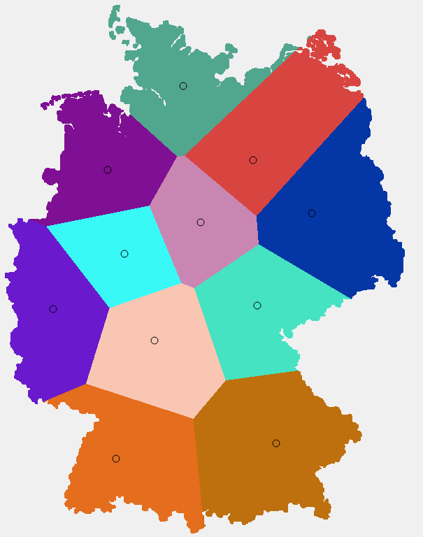
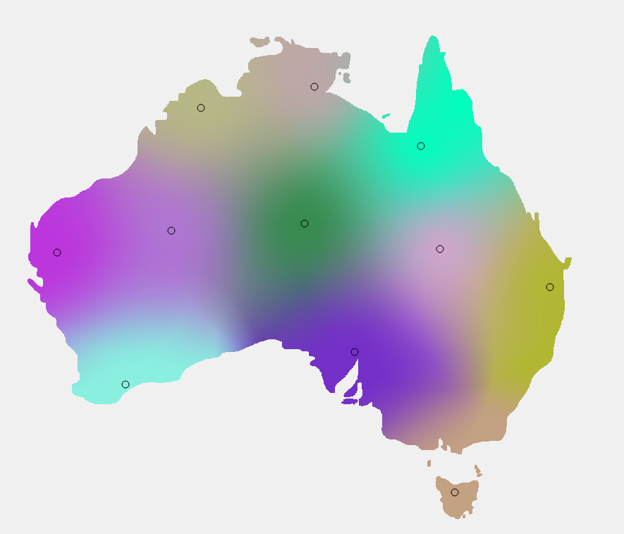
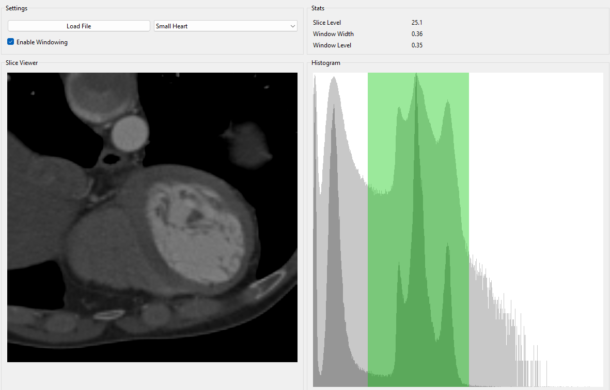
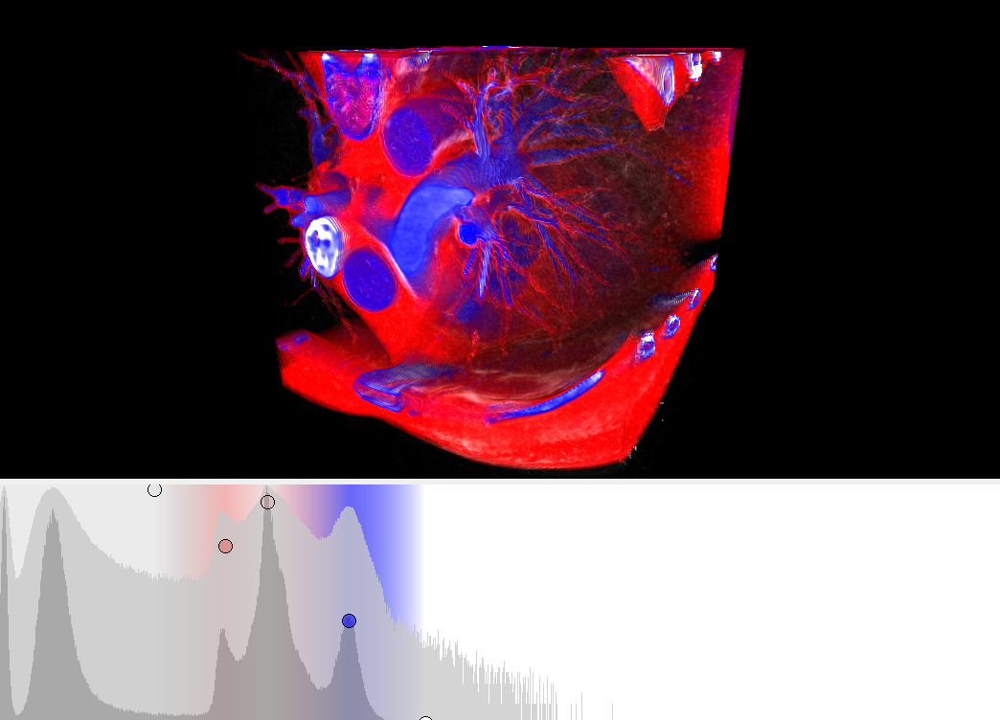
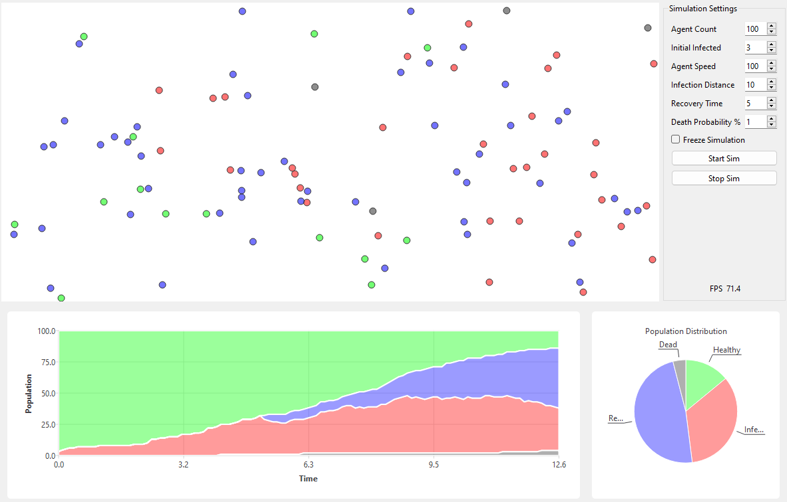

# Simulation and Data Visualization

This repository contains exercise code developed as part of the "Simulation and Data Visualization" course, displaying practical implementations of visualization techniques. The Algorithms are visualized using the Qt-Framework.

Currently featured topics:

- Voronoi Fracture
- Slice Viewer
- Direct Volume Renderer
- Pandemic Simulation


## Getting Started

To get started follow these steps:

1. Make sure [Qt](https://www.qt.io/download-dev) (Version `6.6.3`) is installed on your system

2. Install the Visual Studio extension: [Qt Visual Studio Tools](https://marketplace.visualstudio.com/items?itemName=TheQtCompany.QtVisualStudioTools2022) and configure it for Qt version `6.6.3`

3. Clone this repository to your machine:
   ```bash
   git clone https://github.com/chFleschutz/simulation-and-data-visualization.git
   ```

4. Open the solution in Visual Studio

5. Build and run


## Screenshots

### Voronoi Fracture

<div style="display: flex; justify-content: center;">
   
   
</div>

### Slice Viewer

<div style="display: flex; justify-content: center;">
   
</div>

### Direct Volume Renderer

<div style="display: flex; justify-content: center;">
   
   
</div>

### Pandemic Simulation

<div style="display: flex; justify-content: center;">
   
</div>
